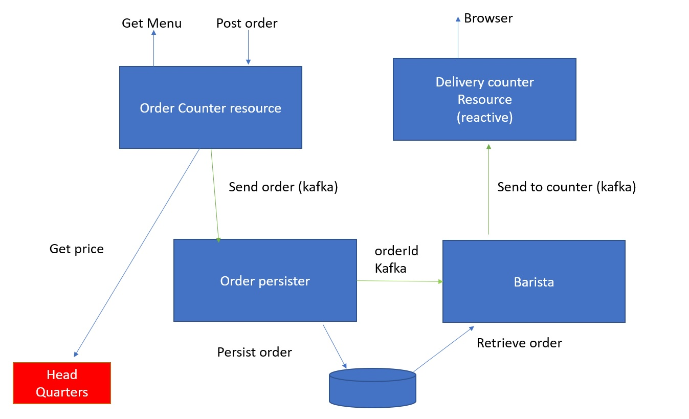

# Build your own coffeehouse


Congratulations! You are the proud owner of a new franchise license of CoffeeBugs ™, so you're allowed to open your own coffeehouse! The coffeehouse has 4 major components:

* The order counter, where you can ask for a menu and place an order
* The administrator (order persist), who will enter you order in the order database
* The barista, who will pick up the order and make the coffee
* The delivery counter, where you can pick up your coffee.

Furthermore, the CoffeeBugs ™ headquarters tries to make us much money from you as possible, so it's not allowed for you to determine your own prices. So for each and every order, you have to get the latest price from headquarters (you'll see that they're rather erratic!).




### Prerequisites

- Java IDE 
- Java 11 JDK
- Docker
- Git
- A database client (either IntelliJ Ultimate, Squirrel or something else)
- Optional: an HTTP client
    - Either Postman, Insomnia, HttpClient (IntelliJ), curl, httpie (or whatever enables you to send POST messages)


### Getting started

- Clone the repository
- Start a Kafka server and database by executing
```
docker-compose up
```
- Start the Coffeehouse service by executing in another terminal
```
./mvnw quarkus:dev
```
Quarkus will start on port 8080 in development mode, which means that any change you make will result in an automatic redeployment. No need to restart the server (usually).

> ![Test][check] Test if the application runs using a browser going to `http://localhost:8080/coffeebugs/menu`

> You should see the interior of the CoffeeBugs ™ coffee shop with on the left a chalkboard with an 'empty' menu (not really empty, since you can play Tic Tac Toe on it)

### Exercise 1: Getting the menu

Create a REST controller which returns the menu containing a greeting message and a list of products. You can use the existing `Menu` class as a data model. 

- Create a config property in the `appliction.properties` containing your greeting message.
- Inject the property as a field into the `OrderCounterResource` class
- Create a REST endpoint of type GET with path `/menu` that will return the menu containing the greeting message. 

> #### With UI
> ![Test][check] Test the endpoint using a browser going to `http://localhost:8080/coffeebugs/menu`

> You should now see the greeting message on the menu board.

> #### Without UI
> ![Test][check] To test the endpoint directly, go to `http://localhost:8080/menu` in a browser

Retrieve the current prices for all beverages from Headquarters

- Create a declarative RestClient in the PricesClient interface that calls `http://localhost:8080/prices/{productname}` where `productname` is the name of the beverage. You can use the `Price` class as a response model.
- Add the appropriate `mp-rest` (url, scope and connectTimeout) MicroProfile properties to the `application.properties`
- Inject the RestClient into the `OrderCounterResource` 
- For each beverage retrieve the current price and add the beverage and price as a `Product` to the menu.

> #### With UI
> ![Test][check] Test the endpoint using a browser going to `http://localhost:8080/coffeebugs/menu`

> You should now see the list of products including prices on the menu board.

> #### Without UI
> ![Test][check] To test the endpoint directly, go to `http://localhost:8080/menu` in a browser

### Exercise 2: Ordering a beverage

Create a REST controller which receives the order and sends it to the `OrderPersister`.

- Create a REST endpoint of type POST with path `/orders` that will receive an `Order`.
- Add the appropriate outgoing properties (connector, topic and serializer) to the `application.properties` (see the [Quarkus Kafka Guide](https://quarkus.io/guides/kafka#configuring-the-kafka-connector))
- Choose a topic name yourself, for instance `orders`
- Use the `io.quarkus.kafka.client.serialization.JsonbSerializer` class as the serializer class
- Inject an `Emitter` of type Order with a channel called `outgoing-orders`.
- Send the received order to the channel. 
- In the `OrderPersister` class create an `incoming` method that receives an `Order`.
- Connect the method to the channel `incoming-orders` using the `@Incoming`-annotation
- Log the incoming order.
- Add the appropriate incoming properties (connector, topic and deserializer) to the `application.properties` (see the [Quarkus Kafka Guide](https://quarkus.io/guides/kafka#configuring-the-kafka-connector))
- Use the `OrderDeserializer` as the deserializer class

> #### With UI
> ![Test][check] Test the endpoint using a browser going to `http://localhost:8080/coffeebugs/order`

> Fill in your name and the beverage you'd like to order from the menu

> You should now see a log message in your application console that the order has been received

> #### Without UI
> ![Test][check] Test the endpoint by executing a POST call to `http://localhost:8080/orders`
> ```json
> { 
>   "customerName": "Your name",
>   "beverage": "latte"
> }
> ```

#### Add Bean Validation

Send an order without a beverage. You should now see an exception in the application because the beverage could not be found.
To prevent this we can add BeanValidation to the `orders` endpoint.

- Add a `@Valid`-annotation to the Order parameter of the endpoint

> #### With UI
> ![Test][check] Test the endpoint using a browser going to `http://localhost:8080/coffeebugs/order`

> Fill in only your name and place the order

> You should now get an HTTP Status code 400 - BAD REQUEST

> #### Without UI
> ![Test][check] Test the endpoint by executing a POST call to `http://localhost:8080/orders`
> ```json
> { 
>   "customerName": "Your name"
> }
> ```


### Exercise 3: Persist the order

Store the order in the database, so the Barista can pick it up later.

We are going to use the Active Record style using Panache. You can also use the Panache Repository (but that will not be explained here).

- The `OrderEntity` class must extend the `PanacheEntity` class and be a JPA entity.
- Add the fields from the `Order` to  the `OrderEntity`.
- Add the persisting logic to the `incoming`-method of the `OrderPersister` class. The `OrderEntity` class has now a lot of methods available, choose wisely.
- Make sure the method is transactional.
- Add the database properties to the `application.properties`
```properties
quarkus.datasource.db-kind=h2
quarkus.datasource.jdbc.url=jdbc:h2:tcp://localhost:1521/~/orders
quarkus.datasource.jdbc.driver=org.h2.Driver
quarkus.datasource.username=coffeehouse
quarkus.datasource.password=coffeehouse
quarkus.hibernate-orm.database.generation=drop-and-create
```

> #### With UI
> ![Test][check] Place an order by going to `http://localhost:8080/coffeebugs/order`

> #### Without UI
> ![Test][check] Post an order to `http://localhost:8080/orders`
> ```json
> { 
>   "customerName": "Your name",
>   "beverage": "espresso"
> }
> ```

You should now see an exception in the console log, complaining that the database operation is a blocking operation and is not allowed on an asynchronous thread.

- Add a `Blocking` annotation to prevent this (or you can make the entire database transaction reactive, but we don't recommend that right now)

> ![Test][check] Place an order and test if the order is persisted in the database by querying the ORDERENTITY table (using the url and credentials above)

### Exercise 4: Informing the Barista

Now we must inform the Barista that an order is ready to be processed. 

- Create a new incoming and outgoing channel pair in the `application.properties`.
- Choose a topic name (for example `prepare`).
- After the order has been persisted, the order has an id. Return this id as the result of the `incoming` method of the `OrderPersister` class.
- Annotate the `incoming` method with the `Outgoing` annotation using the outgoing channel name.

Now we are going to implement the Barista

- Create a config property containing the name of the barista and inject it into the `Barista` class.
- Create a void method `makeBeverage` that receives the order id.
- Log the order id

> #### With UI
> ![Test][check] Place an order by going to `http://localhost:8080/coffeebugs/order`

> See if the order id is logged to the console log.

> #### Without UI
> ![Test][check] Post an order to `http://localhost:8080/orders`
> ```json
> { 
>   "customerName": "Your name",
>   "beverage": "american"
> }
> ```

### Exercise 5: Deliver the order to the delivery counter

Retrieve the order from the database, prepare the delivery and send it to the counter.

- Implement the `DeliveryDeserializer` class (see OrderSerializer for inspiration) so the counter can deserialize the message.
- Create a new incoming and outgoing channel pair (3 properties each) in the `application.properties`.
- Put the `DeliveryDeserializer` in the deserialization configuration for the incoming channel in the `application.properties`.
- Add an additional property `broadcast` and set it to `true` for the incoming channel in the `application.properties`.
- Choose a topic name (for example `delivery`).

In the `makeBeverage` method in the `Barista` class:

- Retrieve the order from the database using the order id
- Create a new `Delivery` instance, filling the barista name, customer name and the beverage
- Return the `Delivery` as the result of the `makeBeverage` method
- Add the appropriate annotations (see `OrderPersister`)

In the `DeliveryCounterResource` we will create a fully reactive endpoint that can be opened as a stream by a browser. The stream contains JSON content.  

- Create a GET endpoint with path `/outcounter` and which produces `test/event-stream` media types
- Add the `@SseElementType` annotation with `application/json` media type 
- Inject a `org.reactivestreams.Publisher` of type `Delivery` into the class which receives the messages from the `Incoming` channel. 
- The GET endpoint should return this publisher as a return type.

> #### With UI
> ![Test][check] Test the endpoint using a browser going to `http://localhost:8080/coffeebugs/out` and place an order here.

> You should see the delivery appear each time you make an order. If your browser does not support event streams, you will be notified and won't be able to see the deliveries appear. 

> #### Without UI
> ![Test][check] Open a new browser tab on `http://localhost:8080/outcounter` and post an order.
> You should see the delivery appear in the outcounter tab.

##### Congratulations! You have now an active CoffeeBugs™ franchise. Now, the next exercises are bonus rounds! See how far you can manage!


### Exercise 6: Fault tolerance

CoffeeBugs ™ has introduced a new endpoint for prices: `/prices/{productName}/v2`. They told you it's more up-to-date, more reliable, and faster. And they want you to switch immediately. Great! Well, not so great... the new endpoint is a disaster, often producing errors and seldom producing any price whatsoever. So, you decided you will make up your own price if the service doesn't work. Rebel!

Make the rest client fault-tolerant by using MicroProfile fault tolerance.

In the `PricesClient`:

* Add a `Retry` annotation with `maxRetries` set to 2. 
* Also, add a `Fallback` annotation with a fallback method name. You can implement a fallback method with the same name as a default method on the interface.
* The fallback method should have the same signature as the client method. You can send a fixed price as a return type.

> ![Test][check] Open a new browser tab on `http://localhost:8080/menu`. After a while, you should see the fixed prices.

Now, this is working, but it takes quite a while for each request. So, let's introduce a circuit breaker.

In the `PricesClient`:

* Add a `CircuitBreaker` annotation. The default values should be fine. 

> ![Test][check] Open a new browser tab on `http://localhost:8080/menu` 
>
> Reload repeatedly. After a while, you should see a noticeable speed improvement since the circuit breaker will be open and the price service isn't called anymore. 


### Exercise 7: Observability

At `http://localhost:8080/health/ready`, all the readiness probes report their status. We're going to make a new readiness probe where we can test the health of the prices endpoint.

Implement the `PriceClientHealthCheck` class:

- Annotate with `Readiness`

- The class should implement the interface `org.eclipse.microprofile.health.HealthCheck`.

- Inject the `PricesClient` interface.

- Build and return readiness response using the `HealthCheckResponseBuilder`builder class. It has a factory method called `named` which you can use to give the probe a description.


> ![Test][check] Open a new browser tab on `http://localhost:8080/health/ready`. You should now see the new probe appear under the description you gave it, with status "UP".


### Exercise 8: Metrics

At `http://localhost:8080/metrics`, you can find a lot of default metrics in the application.

Implement a metric that counts the number of orders placed in the system.

In the `OrderCounterResource` class:

- Annotate the order endpoint with `@Counted` and `@Timed` annotations. The annotations takes a name and a description.

> ![Test][check] Place a couple of orders and open a new browser tab on `http://localhost:8080/metrics`. 
> You should be able to find the metric name and number of placed order somewhere in the list as well as some timing information.
>
> You can also check the `http://localhost:8080/metrics/vendor` and `http://localhost:8080/metrics/application` endpoints to see only vendor specific and application specific metrics.

### Exercise 9: Build a native image

One of the key features of Quarkus is the ability to build a native image using [GraalVM](https://www.graalvm.org/). A native image has a small memory footprint and is blazing fast. This takes three steps:

Build a native image by executing

```bash
mvnw package -Pnative -Dquarkus.native.container-build=true
```

This will create a Linux native executable using a Dockerized version of GraalVM. That means you don't have to install GraalVM yourself.

A Linux native image probably doesn't run on your operating system (unless you have Linux, of course). So, first, we have to containerize the native application:

```bash
docker build -f src/main/docker/Dockerfile.native -t quarkus-coffeehouse/coffeehouse-service .
```

This will create a docker image of the application.

The last step is to just run it:

```
docker run -i --rm -p 8080:8080 quarkus-coffeehouse/coffeehouse-service
```

> ![Test][check] You can now access the application at the usual addresses and endpoints.


### Bonus rounds

If you want to continue extending this application, you can use (some of) the bonus assignments below. 
There is no solution given for these assignments. 
   
#### Adding API documentation and test with Swagger UI

Add some OpenAPI documentation to the application and services and test these services using swagger-ui. 
For more information see [Quarkus - Using OpenAPI and Swagger UI](https://quarkus.io/guides/openapi-swaggerui)
 
#### Make the application non-blocking

To remove the blocking operations, make database access fully reactive with R2DBC (you're on your own here!).
For more information see [Quarkus - Reactive SQL Clients](https://quarkus.io/guides/reactive-sql-clients)

#### More

If you are not done yet, you can check out more [Quarkus - Guides](https://quarkus.io/guides/) 
to implement new features in this application. 


[check]: checkmark.png